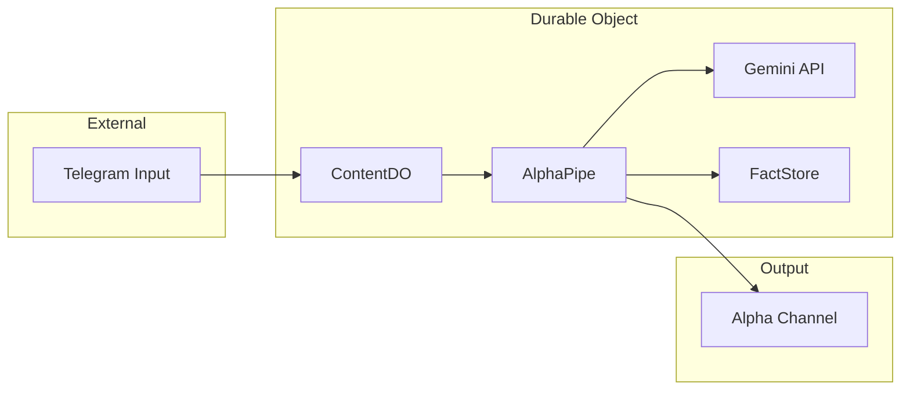

# Architecture: The Alpha Pipe (V3.0)

The Content Refinery has been refactored for **Absolute Simplicity**—removing accidental complexity and focus on the essential transformation of raw Telegram data into refined market intelligence.

## Design Philosophy

> "Simplicity is the absence of complexity." — Rich Hickey

1.  **Decomplection**: Removing the "big ball of mud" for a singular, focused logic path.
2.  **Stateless Boundary**: Infrastructure (Collectors) is separated from Business Logic (The Pipe).
3.  **State as Memory**: SQLite is used solely as an immutable record of processed facts and content hashes.

## Core Components

### 1. The Container (`ContentDO.ts`)
A minimalist Durable Object that handles infrastructure plumbing:
- HTTP Routing (Webhooks & Stats).
- Persistent Schema Migration.
- Context delegation to the Alpha Pipe.

### 2. The Mind (`AlphaPipe.ts`)
The central logic conduit. It coordinates the life cycle of a signal:
- `Ingest` -> `Hash Check` -> `Munger-Li Lu Analysis` -> `Success Mirror`.
- **Mungerian Protocol**: Driven by 100+ lines of inversion, mental models, and moat-auditing logic.
- **Pure Output**: Distills signals into 4000-character "tl;dr takes" with zero summary fluff.

### 3. The Senses (`TelegramCollector.ts`)
A direct link to the Telegram Bot API. It handles normalized payload parsing and message delivery via `fetch`. All status alerts and alpha mirrors flow through this stateless boundary.

### 4. The Memory (`FactStore.ts`)
A minimalist data access layer for SQLite. 
- **Deduplication**: SHA-256 content hashing to save LLM tokens.
- **Optimization**: In-memory counters to prevent expensive `COUNT(*)` storage operations.

## Data Flow (Horizontal)

## Resource Management

- **Operation Cost**: Reduced SQL row reads by 90% via in-memory status counters.
- **Deduplication**: 24-hour analysis vault prevents redundant Gemini calls for identical content.
- **Binary Weight**: Stripped all unused dependencies and auxiliary background processes.
