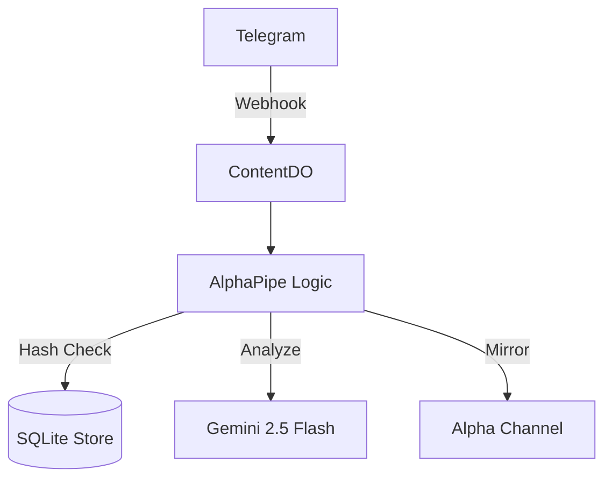

# PRD: Content Refinery (V3.0)

**Project Code Name**: Alpha Pipe  
**Core Objective**: Transform Telegram noise into high-signal Alpha.

## 1. Executive Summary

Content Refinery is a streamlined "Alpha Pipe" built on Cloudflare Workers. It ingests financial data from Telegram, handles deduplication to minimize LLM usage, and mirrors high-conviction signals to output channels. V3.0 focuses on **Absolute Simplicity**, removing accidental complexity like graphs and background agents to ensure a cost-efficient and performant pipeline.

## 2. Target Features

-   **Stateless Ingestion**: Leverages Telegram Bot API webhooks for low-latency ingest without MTProto overhead.
-   **Content Deduplication**: SHA-256 hashing ensures identical content triggers analysis only once every 24 hours.
-   **Mungerian Synthesis**: Utilizes the multidisciplinary wisdom of Charlie Munger and Li Lu (Inversion, Mental Models, Moat Audit) for analysis.
-   **High-Signal Mirroring**: Automated routing of "tl;dr takes" with a relevance score ≥ 80%, including forensic audits and tickers.
-   **Minimalist Ops**: Replaced background "ticks" with event-driven processing to eliminate idle storage operations.

## 3. Architecture Overview

## 4. Key Performance Indicators (KPIs)

-   **Operational Purity**: Zero storage operations during idle periods.
-   **Reliability**: Enforced 4000-character limit for Telegram delivery safety.
-   **Output Density**: "tl;dr takes" only—no summary or fluff.
-   **Simplicity**: Total codebase < 1,000 lines for ease of maintenance.
