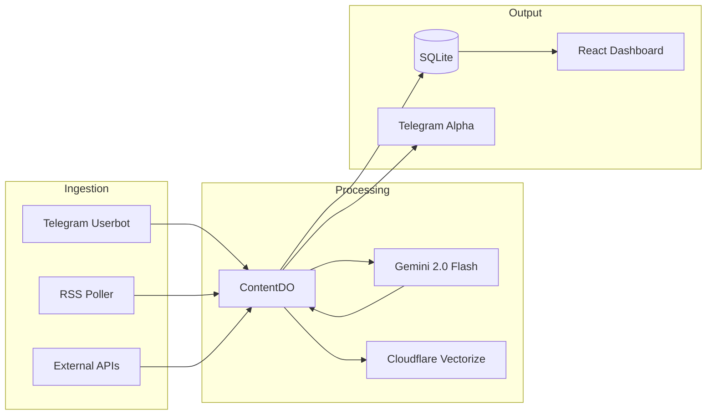

# Content Refinery - Product Requirements Document

**Version**: 2.1  
**Last Updated**: 2026-01-20  
**Status**: Active Development  
**Owner**: Antigravity / Ralph

---

## 1. Executive Summary

Content Refinery is a **Telegram-first Market Intelligence Platform** built on Cloudflare Workers. It ingests financial news from multiple sources (Telegram, RSS, APIs), applies **AI-powered analysis** using Gemini 2.0 Flash, and outputs actionable signals with source attribution and relational knowledge.

---

## 2. Core Features (Deployed)

### 2.1 Multi-Source Ingestion
- **Telegram Userbot**: Live listener for financial channels via MTProto.
- **RSS Feeds**: Periodic polling of configured news sources.
- **Image/PDF OCR**: Gemini Vision for screenshot and document analysis.
- **Voice Transcription**: Audio notes transcribed and ingested as signals.

### 2.2 Epistemic Analyst Engine (NEW)
- **Unified Chain-of-Thought Prompt**: Enforces rigorous fact-checking.
- **Source Hierarchy**: Gold (Primary) > Silver (Secondary) > Bronze (Aggregators).
- **Cognitive Forcing Functions**: Causation vs Correlation, Variant Perception.
- **Output**: Evidence Map, Elevator Pitch, Unanswered Questions.

### 2.3 Interactive Deep Activation (NEW)
- **Telegram Buttons**: Every signal includes 4 action buttons:
    - `🔎 Fact Check`: Forensic Evidence Map.
    - `⚡ Synthesis`: Executive Elevator Pitch.
    - `🧠 Deep Dive`: Epistemic Audit (Limits of Knowledge).
    - `🕸️ Graph`: Entity Relationship Visualization.
- **Callback Handling**: Instant response via Gemini API.

### 2.4 Knowledge Graph
- **Triple Extraction**: Subject-Predicate-Object relationships.
- **SQLite Storage**: Persistent relational queries.
- **Visualization**: 2D Force-Directed Graph in React Dashboard.

### 2.5 Vector Intelligence (Semantic Search)
- **Vectorize**: Cloudflare Vectorize for embedding storage.
- **Embedding Model**: `@cf/baai/bge-base-en-v1.5`.
- **Search Endpoint**: `/search/vector?q=<query>`.

### 2.6 Signal Mirroring
- **Alpha Channel**: High-score signals (>80) forwarded to `@highsignalalpha`.
- **Daily Briefings**: AM/PM cron-triggered summaries.

---

## 3. Architecture

---

## 4. Testing & Quality

- **Unit Tests**: 18 passing (Vitest + Node.js environment).
- **Coverage**:
    - Core Logic (Caching, Hashing, Rate Limiting)
    - Epistemic Engine (Button Routing, Prompt Generation)
    - Utilities (RSS Parsing, Error Logging)
- **Type Checking**: `tsc --noEmit` clean.

---

## 5. Deployment

- **Platform**: Cloudflare Workers (Durable Objects).
- **Bindings**: `VECTOR_INDEX`, `AI`, `CONTENT_DO`.
- **Domains**: `api.moecapital.com/*`.
- **Schedules**: `*/5 * * * *` (processing), `0 5,17 * * *` (briefings).

---

## 6. Roadmap

See [ROADMAP.md](./ROADMAP.md) for Phase 18 and beyond.

---

## 7. Specifications

- [Phase 4 Enterprise PRD](./specs/prd.md)
- [Phase 5 Improvements PRD](./specs/prd_v5.md)
