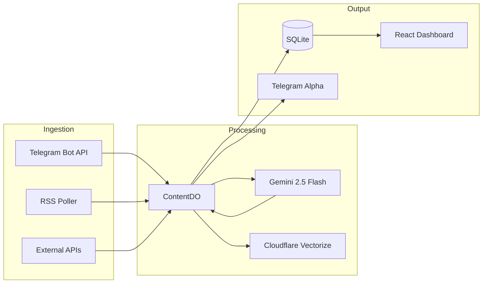

# Content Refinery - Product Requirements Document

**Version**: 4.0  
**Last Updated**: 2026-02-01  
**Status**: Active Development  
**Owner**: Antigravity / Ralph

---

## 1. Executive Summary

Content Refinery is a **Telegram-first Market Intelligence Platform** built on Cloudflare Workers. It ingests financial news from multiple sources (Telegram, RSS, Webhooks), applies **AI-powered analysis** using Gemini 2.5 Flash, and outputs actionable signals with source attribution and relational knowledge. The system is designed with **Data-Oriented** principles, treating every insight as an immutable "Fact".

---

## 2. Core Features (Deployed)

### 2.1 Multi-Source Ingestion

- **Telegram Bot API**: Stateless webhook listener (replacing legacy MTProto userbot).
- **RSS Feeds**: Periodic polling of news sources.
- **Resource Optimization**:
  - **Elastic Heartbeat**: Dynamic backoff for compute conservation.
  - **AI Deduplication**: Hashing-based analysis reuse.
  - **Granular Extraction**: De-interleaving multiple ideas from batch inputs.
- **Image/PDF OCR**: Gemini Vision for screenshot and document analysis.

### 2.2 Epistemic Analyst Engine

- **Unified Chain-of-Thought Prompt**: Enforces rigorous fact-checking.
- **Output**: Evidence Map, Elevator Pitch, Unanswered Questions.
- **Deep Activation**: Callback buttons (`🔎 Fact Check`, `⚡ Synthesis`, `🧠 Deep Dive`).

### 2.3 Predictive Alpha (NEW)

- **PredictiveEngine**: Scans Knowledge Graph for entity clusters and historical sentiment.
- **Conviction Scoring**: Generates forward-looking predictions with confidence intervals.
- **Format**: Unique "Predictive Alpha" UI with conviction percentages.

### 2.4 Signal Mirroring

- **High Signal Alpha**: Signals with score ≥ 80 mirrored to primary delivery channel.
- **Low Signal Beta**: Signals with score 60-79 mirrored to a "Low Signal" filter channel.
- **Daily Briefings**: AM/PM cron-triggered summaries.

### 2.5 Knowledge Graph

- **Triple Extraction**: Subject-Predicate-Object relationships (e.g., `Asset -> event -> impact`).
- **Graph Nodes**: Entity-based tracking with persistent relational lookups.

### 2.6 Admin & Recovery Engine

- **Force Reprocess**: Triggered historical analysis for any message ID.
- **Recovery Audit**: `/admin/audit/recover-missed` finds and force-mirrors high-value signals missed by transient network failures.
- **Peer Resolution**: Robust MTProto ID handling for historical backfills.

---

## 3. Architecture

---

## 4. Testing & Quality

- **Unit Tests**: 18 passing (Vitest + Node.js environment).
- **Coverage**:
  - Core Logic (Caching, Hashing, Rate Limiting)
  - Epistemic Engine (Button Routing, Prompt Generation)
  - Utilities (RSS Parsing, Error Logging)
- **Type Checking**: `tsc --noEmit` clean.

---

## 5. Deployment

- **Platform**: Cloudflare Workers (Durable Objects).
- **Bindings**: `VECTOR_INDEX`, `AI`, `CONTENT_DO`.
- **Domains**: `api.moecapital.com/*`.
- **Schedules**: `*/5 * * * *` (processing), `0 5,17 * * *` (briefings).

---

## 6. Roadmap

See [ROADMAP.md](./ROADMAP.md) for Phase 18 and beyond.

---

## 7. Specifications

- [Phase 4 Enterprise PRD](./specs/prd.md)
- [Phase 5 Improvements PRD](./specs/prd_v5.md)
