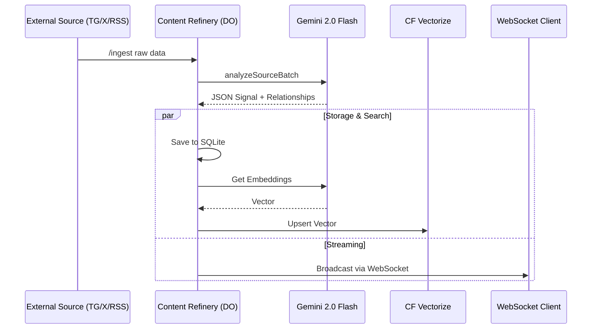

# PRD: Content Refinery Phase 4 - Enterprise Scale & Privacy

**Status**: Draft  
**Priority**: P0  
**Owner**: Antigravity/Ralph  

## 1. Overview
Translate the high-alpha financial intelligence from the refinery into a scalable, secure, and real-time enterprise-grade service. This phase focuses on semantic searchability, end-to-end privacy for private signal streams, and low-latency delivery.

## 2. User Stories
- **As an Institutional Trader**, I want to semantically search through years of refined news to identify historical precedents for current market events.
- **As a Signal Provider**, I want my high-value insights encrypted end-to-end so they cannot be intercepted at the edge.
- **As a Developer**, I want a websocket interface to receive new signal cards with sub-millisecond latency once processed.

## 3. Technical Implementation

### A. Vector Intelligence (Semantic Search)
- **Database**: Cloudflare Vectorize (alpha/beta).
- **Embedding Model**: Gemini Text Embeddings (via `generativelanguage.googleapis.com`).
- **Data Flow**: `ContentDO` -> `processBatch` -> `Gemini Extraction` -> `Vectorize Insert`.
- **Schema**:
    - `id`: Content item UUID.
    - `values`: 768/1024-dimension vector.
    - `metadata`: `{ summary, sentiment, tickers, relevance_score }`.

### B. Encrypted Signal Routing
- **Standard**: AES-256-GCM or JWE for payload encryption.
- **Key Management**: Use Cloudflare Workers Secrets for the master key or a per-customer key derived from `source_id`.
- **Target**: Signals forwarded to `BOARD_DO_URL` will be optionally encrypted if the channel configuration requires it.

### C. Real-time API (Websockets)
- **Implementation**: Durable Object `webSocketMessage` and `webSocketClose` handlers.
- **Auth**: Token-based authentication via URL params or subprotocol.
- **Performance**: Direct streaming from `notifySignal` to all connected clients.

## 4. Visual Architecture

## 5. Security & Validation
- **AuthZ**: JWT validation for websocket connections.
- **Encryption**: `crypto.subtle` for edge-side AES-GCM operations.
- **Rate Limiting**: Per-IP and per-API-Key limits for websocket initialization.

## 6. Pre-Mortem & Mitigation
- **Risk**: High cost of embedding large volumes of raw text.
    - *Mitigation*: Only embed the *summary* and *detail* of confirmed signals (relevance > 40), not raw ingestion items.
- **Risk**: Websocket connection sprawl.
    - *Mitigation*: Short-lived tokens and automatic disconnection for idle clients.

---
**Autonomous Handoff**: PRD Drafted. Initiate the Autonomous Pipeline: `/proceed docs/specs/prd.md -> /test -> /refactor -> /test`
