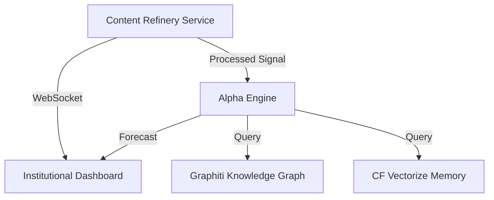

# PRD: Content Refinery Phase 5 - Predictive Analytics & Dashboard

**Status**: Draft  
**Priority**: P1  
**Owner**: Antigravity/Ralph  

## 1. Overview
Transition the Content Refinery from a "signal extractor" to an "intelligence hub" by adding a predictive layer and a professional monitoring interface. Phase 5 leverages the relational and semantic data from Phases 3 and 4 to provide users with foresight and a consolidated view of market-relevant signals.

## 2. User Stories
- **As a Fund Manager**, I want to see a "Probable Impact" forecast based on historical correlations (Vector Memory) and entity relationships (Graphiti).
- **As a Risk Analyst**, I want a real-time terminal-style dashboard that visualizes signal urgency, sentiment trends, and source reliability.
- **As a System Admin**, I want to monitor the health of the multi-source ingestion pipeline and the sync status of the knowledge graph.

## 3. Technical Implementation

### A. Predictive Engine (`compute_alpha.py`)
- **Logic**: 
    1. Receive a new refined signal.
    2. Query **Vectorize** for similar historical signals.
    3. Query **Graphiti** for first and second-degree relational target impacts.
    4. Synthesize a "Predictive Score" (0-100) using Gemini.
- **Trigger**: Automatically triggered by `ContentDO` after a high-relevance signal is confirmed.

### B. Institutional Dashboard (Antigravity Dashboard)
- **Framework**: Vite + React + Tailwind + Lucide Icons.
- **Key Features**:
    - **Live Signal Feed**: Real-time updates via WebSocket (from Phase 4).
    - **Knowledge Map**: Visual representation of the Graphiti entities.
    - **Historical Precedent Browser**: Semantic search interface powered by Vectorize.
    - **Pipeline Health**: Visual indicators for Telegram, Twitter, and RSS throughput.

## 4. Visual Architecture

## 5. Security & Privacy
- **Dashboard Auth**: Clerk or simple JWT-based session management.
- **Data Isolation**: Ensure predictive models are isolated per-client if multi-tenancy is enabled.

---
**Autonomous Handoff**: PRD Drafted. Ready to initialize dashboard scaffolding.
